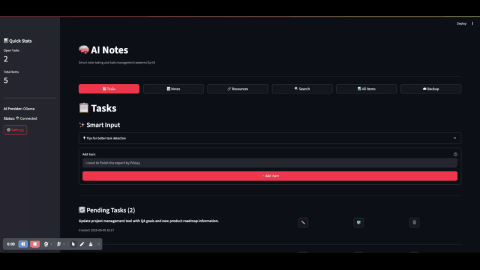

# AI Notes & Task Manager

A powerful AI-enhanced note-taking and task management application with local storage, cloud backup, and intelligent features.

## ✨ Features

- 📝 **Smart Note Taking**: Create, edit, and organize notes with AI enhancement
- 🎯 **Task Management**: Track tasks with priorities and due dates
- 🔍 **AI-Powered Search**: Find notes using semantic search
- ☁️ **Google Drive Backup**: Automatic cloud synchronization
- 🖥️ **Multiple Interfaces**: Web app and native macOS app
- 🔒 **Local Storage**: All data stored locally with SQLite
- 🤖 **AI Integration**: Support for multiple AI providers (Ollama, OpenAI)

## 🎬 Demo



*Creating notes, managing tasks, and using AI features*

## 🚀 Quick Start

### Option 1: Web Application (Recommended)

1. **Setup and Run**:
   ```bash
   cd /Users/amaske/Documents/AI_Note_App
   ./run_macos.sh setup    # First time only
   ./run_macos.sh web      # Start web app
   ```

2. **Access**: Open http://localhost:8501 in your browser

### Option 2: Native macOS App

1. **Setup and Run**:
   ```bash
   cd /Users/amaske/Documents/AI_Note_App
   ./run_macos.sh setup    # First time only
   ./run_macos.sh app      # Start macOS app
   ```

2. **Desktop Launcher** (Optional):
   - Double-click `launch_ai_notes.command` from Desktop
   - Or use the AppleScript launcher: `AI_Notes_Launcher.applescript`

## 📋 Prerequisites

- **macOS** (tested on macOS 14+)
- **Python 3.8+** (automatically managed via virtual environment)
- **Internet connection** (for AI features and cloud backup)

## 🔧 Installation & Setup

### 1. Initial Setup
```bash
# Clone or download the project
cd /Users/amaske/Documents/AI_Note_App

# Run setup (creates virtual environment and installs dependencies)
./run_macos.sh setup
```

### 2. Configure AI Provider (Optional)
Edit `llm_config.json`:
```json
{
  "provider": "ollama",
  "ollama_model": "llama3.1",
  "openai_api_key": "your-api-key-here"
}
```

### 3. Google Drive Backup (Optional)
```bash
# Follow the setup guide
./run_macos.sh google-setup
```

## 🎮 Usage Commands

### Main Commands
```bash
# Web Application
./run_macos.sh web          # Start web interface
./run_macos.sh web --port 8502  # Custom port

# macOS Native App
./run_macos.sh app          # Start native app

# Setup & Maintenance
./run_macos.sh setup        # Initial setup
./run_macos.sh update       # Update dependencies
./run_macos.sh google-setup # Configure Google Drive
```

### Backup & Restore
```bash
# Manual backup
./backup_ai_notes.command

# Restore from backup
python backup_manager.py --restore backup_20240101_120000.zip
```

## 🖥️ Interface Options

### Web Interface (Streamlit)
- **URL**: http://localhost:8501
- **Features**: Full-featured web interface
- **Best for**: Daily use, cross-platform access

### macOS Native App (PyQt6)
- **Type**: Native macOS application
- **Features**: System integration, dock icon, notifications
- **Best for**: Native macOS experience

## ⚙️ Configuration

### AI Provider Setup

#### Ollama (Local AI)
```bash
# Install Ollama
brew install ollama

# Pull a model
ollama pull llama3.1

# Update config
{
  "provider": "ollama",
  "ollama_model": "llama3.1"
}
```

#### OpenAI (Cloud AI)
```json
{
  "provider": "openai",
  "openai_api_key": "sk-your-api-key-here"
}
```

### Google Drive Backup
1. Run: `./run_macos.sh google-setup`
2. Follow the authentication flow
3. Automatic backups will be enabled

## 📁 Project Structure

```
AI_Note_App/
├── ai_note_app.py              # Main Streamlit app
├── macos_app.py                # Native macOS app
├── run_macos.sh                # Main launcher script
├── launch_ai_notes.command     # Desktop launcher
├── core/                       # Core services
│   ├── agent_service.py        # AI agent logic
│   ├── ai_service.py           # AI provider interface
│   ├── database_service.py     # SQLite operations
│   ├── backup_service.py       # Google Drive backup
│   └── search_service.py       # FAISS vector search
├── backup_manager.py           # Backup utilities
├── setup_google_drive.py       # Google Drive setup
├── notes.db                    # SQLite database
├── faiss.index                 # Search index
└── llm_config.json            # AI configuration
```

## 🔍 Troubleshooting

### Common Issues

**Virtual environment not found**:
```bash
./run_macos.sh setup
```

**Port already in use**:
```bash
./run_macos.sh web --port 8502
```

**AI not working**:
```bash
# Check Ollama
ollama list

# Or verify OpenAI key in llm_config.json
```

**Google Drive issues**:
```bash
./run_macos.sh google-setup
```

### Logs & Debugging
- Check terminal output for detailed error messages
- Backup logs are in the `backups/` directory
- Database issues: Delete `notes.db` to reset (loses data)

## 🆘 Getting Help

1. **Check logs**: Terminal output shows detailed error messages
2. **Reset database**: Delete `notes.db` if corrupted
3. **Reinstall**: Delete `venv_mcp/` and run `./run_macos.sh setup`
4. **Backup first**: Always backup data before troubleshooting

## � License

This project is licensed under the MIT License - see the LICENSE file for details.

---

**Quick Start Summary**:
1. `cd /Users/amaske/Documents/AI_Note_App`
2. `./run_macos.sh setup` (first time)
3. `./run_macos.sh web` (web) or `./run_macos.sh app` (macOS)
4. Open http://localhost:8501 (web) or use the native app window